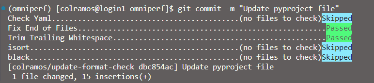

## How to fork from us

To keep our development fast and conflict free, we recommend you to [fork](https://github.com/ROCm/rocprofiler-compute/fork) our repository and start your work from our `amd-staging` branch in your private repository.

Afterwards, git clone your repository to your local machine. But that is not it! To keep track of the original develop repository, add it as another remote.

```
git remote add mainline https://github.com/ROCm/rocprofiler-compute.git
git checkout amd-staging
```

As always in git, start a new branch with

```
git checkout -b topic-<yourFeatureName>
```

and apply your changes there.

## How to contribute to ROCm Compute Profiler

### Did you find a bug?

- Ensure the bug was not already reported by searching on GitHub under [Issues](https://github.com/ROCm/rocprofiler-compute/issues).

- If you're unable to find an open issue addressing the problem, [open a new one](https://github.com/ROCm/rocprofiler-compute/issues/new).

### Did you write a patch that fixes a bug?

- Open a new GitHub [pull request](https://github.com/ROCm/rocprofiler-compute/compare) with the patch.

- Ensure the PR description clearly describes the problem and solution. If there is an existing GitHub issue open describing this bug, please include it in the description so we can close it.

- Ensure the PR is based on the `amd-staging` branch of the ROCm Compute Profiler GitHub repository.

> [!TIP]
> To ensure you meet all formatting requirements before publishing, we recommend you utilize our included [*pre-commit hooks*](https://pre-commit.com/#introduction). For more information on how to use pre-commit hooks please see the [section below](#using-pre-commit-hooks).

## Using pre-commit hooks

Our project supports optional [*pre-commit hooks*](https://pre-commit.com/#introduction) which developers can leverage to verify formatting before publishing their code. Once enabled, any commits you propose to the repository will be automatically checked for formatting. Initial setup is as follows:

```console
python3 -m pip install pre-commit
cd rocprofiler-compute
pre-commit install
```

Now, when you commit code to the repository you should see something like this:



Please see the [pre-commit documentation](https://pre-commit.com/#quick-start) for additional information.
